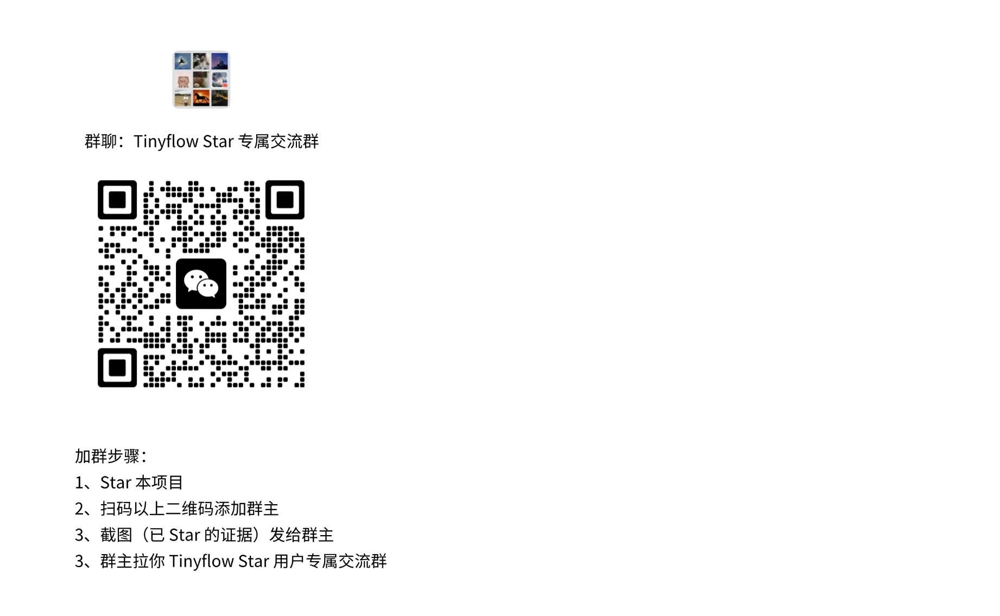

# Tinyflow-java

Tinyflow-java 是一个使用 Java 开发的智能体编排解决方案，她不是一个产品，而是一个开发组件。
通过集成 Tinyflow-java，您可以使得任何的传统的 Java Web 应用，具备 AI 智能体流程编排的能力。

## 特点

- 轻量（支持 Java 8 及以上版本，不限制开发框架）
- 灵活（内置丰富的节点类型，支持同步或异步执行）
- 高性能（基于 Java 开发，性能比 Nodejs 和 Python 更快） 


## 前端

 Tinyflow-java 的前端拖拽组件， 开源地址：https://gitee.com/tinyflow-ai/tinyflow
 
## 快速开始

引入依赖

```xml
<dependency>
    <groupId>dev.tinyflow</groupId>
    <artifactId>tinyflow-java-core</artifactId>
    <version>1.1.6</version>
</dependency>
```

初始化 Tinyflow

```java
String flowDataJson = "从前端传递的流程数据";
Tinyflow tinyflow = new Tinyflow(flowDataJson);

Map<String, Object> variables = new HashMap<>();
variables.put("name", "张三");
variables.put("age", 18);

tinyflow.execute(variables);
```


## Star 用户专属交流群

